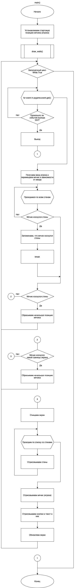
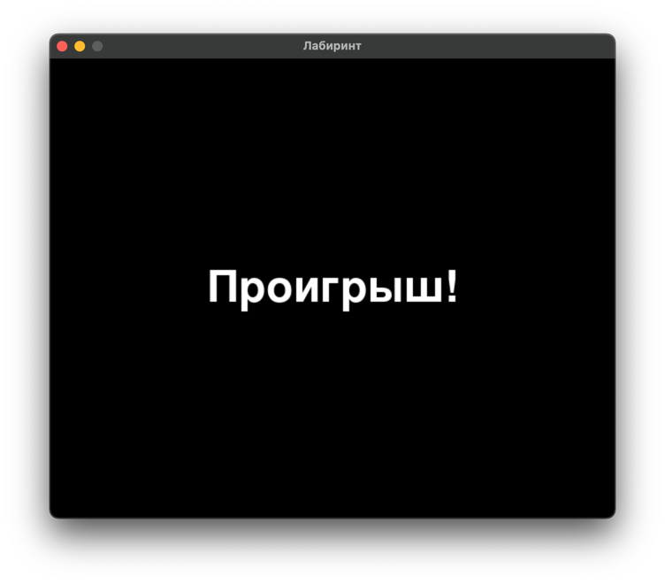
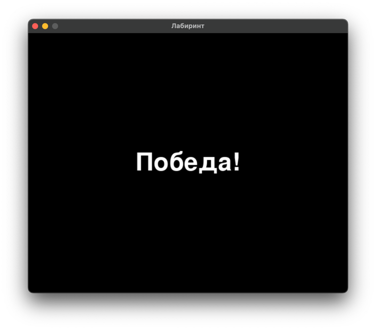

# Практическая работа №24 #

### Тема: Применение коллизиий ###

### Цель: Совершенствование навыков составления программ с библиотекой Pygame ###

#### Задача: ####

> Создайте столкновение объектов для своей игры, продумайте стратегию победы и проигрыша.
##### Контрольный пример: #####

> Получаю:
> 1) Коллизии в игре;
> 2) Условия победы;
> 3Условия поражения.

##### Системный анализ: #####

> Входные данные: `None`    
> Промежуточные данные: `int screen_width`, `int screen_height`, `tuple black`, `tuple white`, `tuple red`,
`tuple green`, `tuple blue` `int line_width`, `int line_gap`, `int line_offset`, `int door_width`,
`int max_openings_per_line`, `int player_radius`, `int player_speed`, `int player_x`, `int player_y`, `list lines`, `int num_openings`, `list openings`, `int last_opening_bottom`,
 `bool collided`    
> Выходные данные: `background_image`
##### Блок схема: #####


##### Код программы: #####

```python
import pygame
import random

# Инициализация Pygame
pygame.init()

# Ширина и высота экрана
screen_width = 640
screen_height = 520
screen = pygame.display.set_mode((screen_width, screen_height))
pygame.display.set_caption('Лабиринт')

# Цвета
black = (0, 0, 0)
white = (255, 255, 255)
red = (255, 0, 0)
green = (0, 255, 0)
blue = (0, 0, 255)

# Параметры стен и дверей
line_width = 10
line_gap = 40
line_offset = 20
door_width = 40
max_openings_per_line = 5

# Параметры игрока и начальная позиция
player_radius = 10
player_speed = 2
player_x = screen_width - 12
player_y = screen_height - 60

# Загрузка и масштабирование фонового изображения
background_image = pygame.image.load('background.jpg')
background_image = pygame.transform.scale(background_image, (screen_width, screen_height))

# Функция для отрисовки стен
def draw_walls():
    lines = []
    for i in range(0, screen_width, line_gap):
        num_openings = random.randint(1, max_openings_per_line)
        openings = sorted(random.sample(range(line_offset + door_width, screen_height - line_offset - door_width), num_openings))

        last_opening_bottom = 0
        for opening_top in openings:
            # Верхний сегмент стены
            if last_opening_bottom < opening_top:
                lines.append(pygame.Rect(i, last_opening_bottom, line_width, opening_top - last_opening_bottom))
            last_opening_bottom = opening_top + door_width
        # Нижний сегмент стены
        if last_opening_bottom < screen_height:
            lines.append(pygame.Rect(i, last_opening_bottom, line_width, screen_height - last_opening_bottom))
    return lines

# Функция для отображения текста
def show_message(message):
    font = pygame.font.Font(None, 74)
    text = font.render(message, True, white)
    text_rect = text.get_rect(center=(screen_width // 2, screen_height // 2))
    screen.fill(black)
    screen.blit(text, text_rect)
    pygame.display.update()
    pygame.time.delay(5000)  # Подождать 5 секунд

# Основная функция
def main():
    global player_x, player_y
    lines = draw_walls()  # Отрисовка стен
    clock = pygame.time.Clock()

    while True:
        for event in pygame.event.get():
            if event.type == pygame.QUIT:
                pygame.quit()
                quit()

        # Движение игрока
        keys = pygame.key.get_pressed()
        if keys[pygame.K_LEFT] and player_x > player_radius:
            player_x -= player_speed
        elif keys[pygame.K_RIGHT] and player_x < screen_width - player_radius:
            player_x += player_speed
        elif keys[pygame.K_UP] and player_y > player_radius:
            player_y -= player_speed
        elif keys[pygame.K_DOWN] and player_y < screen_height - player_radius:
            player_y += player_speed

        # Проверка столкновений игрока со стенами
        player_rect = pygame.Rect(player_x - player_radius, player_y - player_radius, player_radius * 2, player_radius * 2)
        collided = False

        for line in lines:
            if line.colliderect(player_rect):
                collided = True
                break

        # Проверка столкновения со стеной (поражение)
        if collided:
            show_message("Проигрыш!")  # Показать сообщение о поражении
            break  # Выйти из цикла игры

        # Проверка столкновения с левой стеной (победа)
        if player_rect.colliderect(pygame.Rect(0, 0, line_width, screen_height)):
            show_message("Победа!")  # Показать сообщение о победе
            break  # Выйти из цикла игры

        # Очистка экрана
        screen.blit(background_image, (0, 0))

        # Отрисовка стен
        for line in lines:
            pygame.draw.rect(screen, red, line)

        # Отрисовка игрока
        pygame.draw.circle(screen, green, (player_x, player_y), player_radius)

        pygame.display.update()
        clock.tick(60)  # Поддержка 60 кадров в секунду

# Запуск основной функции
if __name__ == "__main__":
    main()

```

##### Результат работы программы: #####

> 1. В игру были добавлены коллизии - при столкновении со стеной происходит поражение;      
> 2. В игру были добавлены условия победы - столкновение с левой границей экрана; поражения - столкновение со стеной.    
   
       

##### Контрольные вопросы: #####

1. Модули для работы программы:  
   `pygame`: Библиотека для создания игр, обеспечивающая работу с графикой, звуком и событиями.  
   `random`: Модуль для генерации случайных чисел, используемый для случайного размещения стен в лабиринте.  

2. Функции для работы программы:  
   `main()`: Основная функция программы, управляющая логикой игры, обработкой событий, движением игрока и отрисовкой
   элементов на экране.  
   `draw_walls()`: Функция для отрисовки стен лабиринта, генерирующая случайные отверстия в стенах и возвращающая их
   позиции в виде списка прямоугольников.  
   `show_message(message)`: Функция для отображения текстовых сообщений (например, "Победа!" или "Проигрыш!") на
   экране.  

##### Вывод по проделанной работе: #####

> В ходе данной практики я добавил в свою игру коллизии, а также условия победы и поражения.
